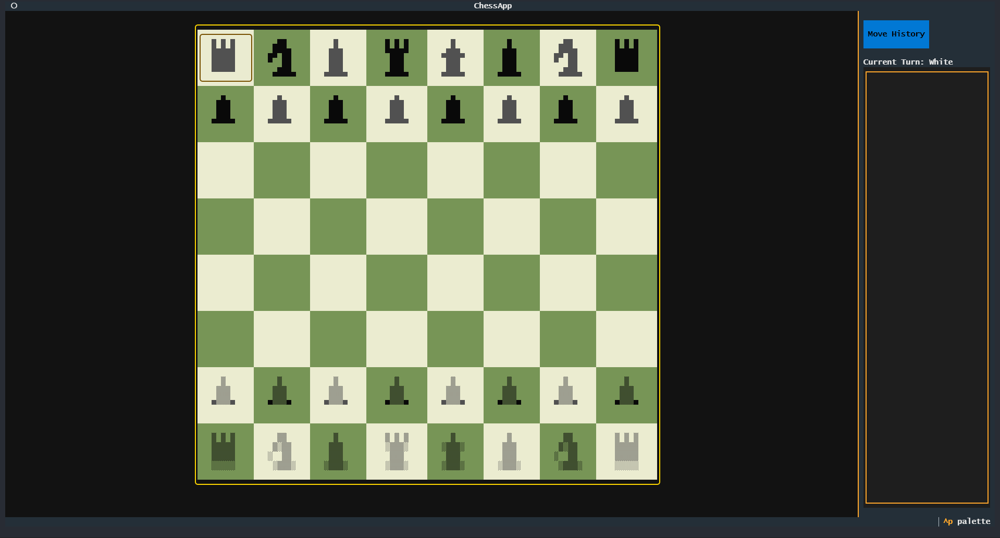
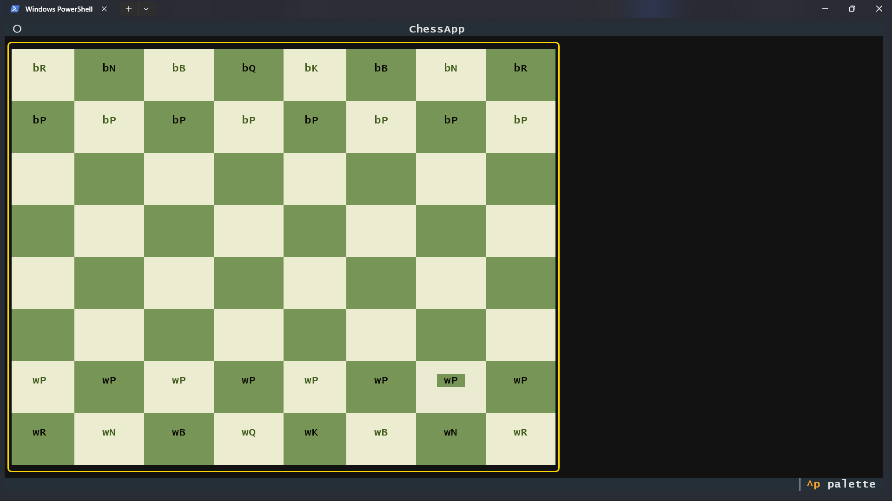
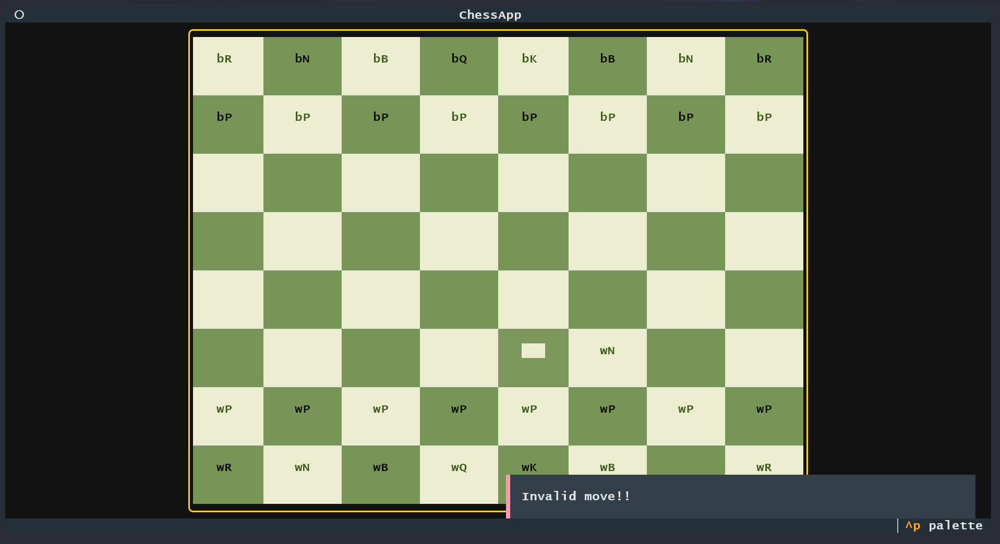
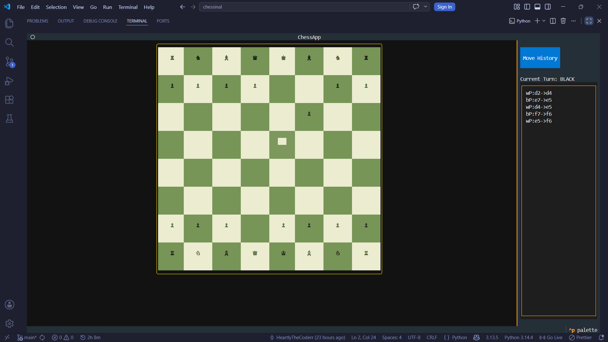
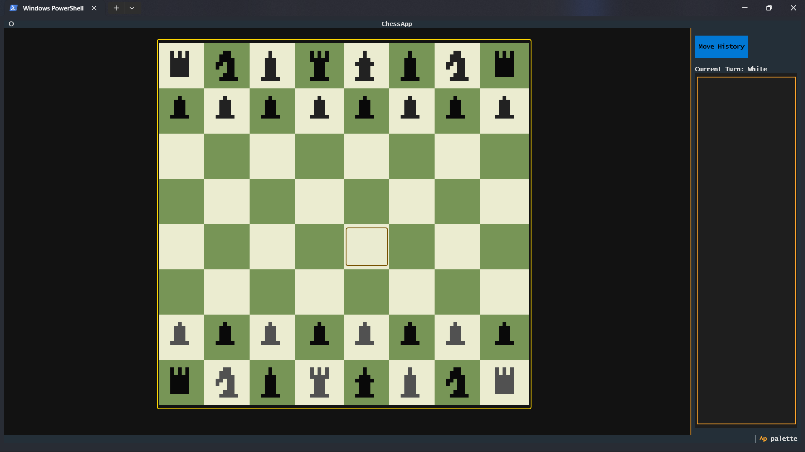
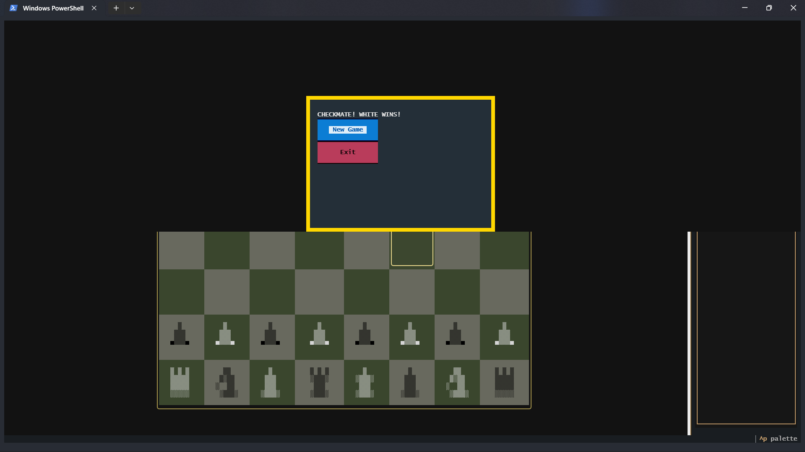

# Chessinal


**Chess in your terminal..** Build with textual library for those beautiful UI and custom script for chess mech. No heavy graphics, just raw logic and TUI :D. For now play with your friends by pass and play! later I will add multiplay (EXAMS ARE GOING ON RN SORRYYY!)

## NOTE: For non-windows user, you won't be able to use compiled form so, you can clone the repo then run
```
pip install -r requirements.txt
```
## Then
```
python main.py
```

## Nothing much to say..
## Look at the ss of updates... or kinda devlogs of main UI.

### 1


### 2


### 3


### 4


### 5


### 6



## Build command
```
pyinstaller --onefile --name Chessinal --collect-all textual --collect-all rich --exclude-module PyQt5 --exclude-module PySide2 --exclude-module PySide6 --exclude-module PyQt6 --exclude-module matplotlib --exclude-module numpy --exclude-module tkinter main.py
```
